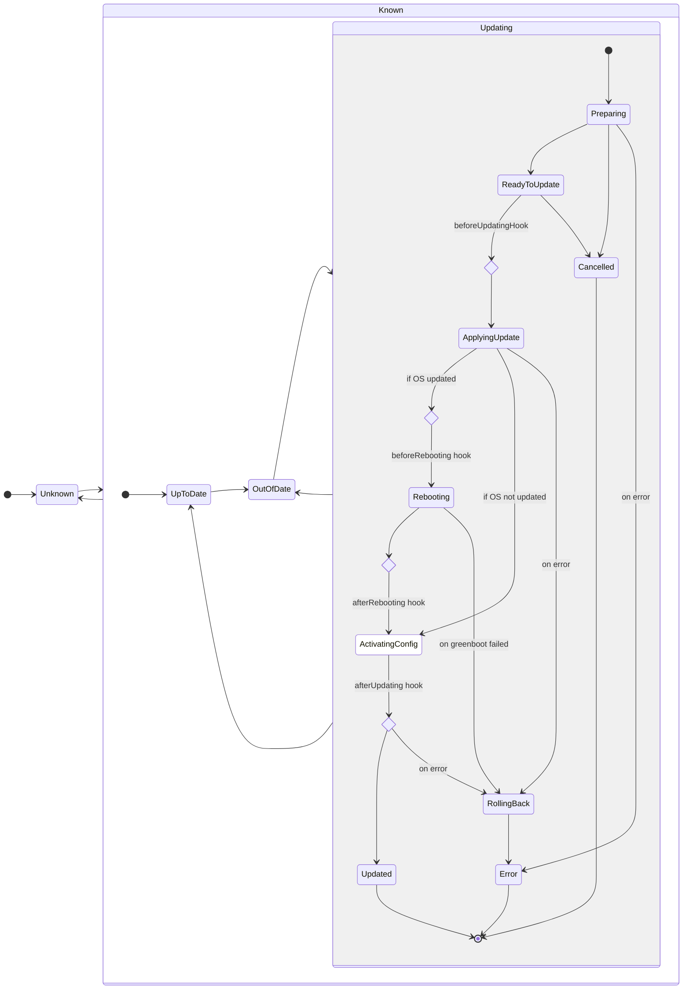

# Device API Statuses

The following sections document the various statuses reported by Flight Control's Device API. These statuses represent the _service's view_ of the managed device, which is the _last reported_ status from the device agent augmented by service's local context and user policies. The _last reported_ status in turn may be outdated relative to the agent's _current status_ due to reporting delays.

## Device Status

The Device Status reflects the availability and health of the device's hardware and operating system.

The `device.status.summary` field can have the following values:

| Status | Description | Formal Definition |
| ------ | ----------- | ----------------- |

## Device Update Status

The Device Update Status reflects whether the device's currently running specification (OS, configuration, applications, etc.) matches the user's intent as expressed via the device spec or the fleet's device template.

The `device.status.updated.status` field can have the following values:

| Status | Description | Formal Definition |
| ------ | ----------- | ----------------- |
| `UpToDate` | The device is running according to its device spec. If the device is part of a fleet, that device spec is at the same version as the fleet's device template. | `deviceMeetsDeviceSpec && (deviceIsNotFleetManaged \|\| deviceSpecAtFleetSpec)` |
| `Updating` | The device is in the process of updating to its device spec. | `deviceIsUpdating` |
| `OutOfDate` | The device is not `UpToDate` and not `Updating`. | |
| `Unkown` | The device's agent either never reported status or its last reported status was `Updating` and the device has been disconnected since. | |

whereby the formal definition uses the following helper definitions:

```golang
// a device is assumed disconnected if its agent hasn't sent an update for the duration of a disconnectionTimeout
deviceIsDisconnected := device.status.lastSeen + disconnectionTimeout < time.Now()

// a device is not managed by a fleet if its owner field is unset
deviceIsNotFleetManaged := len(device.metadata.owner) == 0

// a device is updating when the agent sets the "Updating" condition to true
deviceIsUpdating := device.status.conditions.updating == true

// a device meets its device spec when the version of the device spec that the agent reports as running
// equals the version rendered to the device by the service
deviceMeetsDeviceSpec := device.status.config.renderedVersion == device.metadata.annotations.renderedVersion

// a device spec is up-to-date relative to the fleet's device template if both are of the same template version.
deviceSpecAtFleetSpec := device.metadata.annotations.templateVersion == fleet[device.metadata.owner].spec.templateVersion
```

The `device.status.updated.???` field contains the current state of the update in progress and can take the following values:

| Update State | Description |
| ------------ | ----------- |
| `Preparing` | The agent is validating the desired device spec and downloading dependencies. No changes have been made to the device's configuration yet. |
| `ReadyToUpdate` | The agent has validated the desired spec, downloaded all dependencies, and is ready to update. No changes have been made to the device's configuration yet. |
| `ApplyingUpdate` | The agent has started the update transaction and is writing the update to disk. |
| `Rebooting` | The agent initiated a reboot required to activate the new OS image and configuration. |
| `ActivatingConfig` | (transient, not reported) The agent is activating the new configuration without requiring a reboot. |
| `RollingBack` | The agent has detected and error and is rolling back to the pre-update OS image and configuration. |
| `Updated` | The agent has successfully completed the update and the device is conforming to its device spec. Note that the device's update status may still be reported as `OutOfDate` if the device spec is not yet at the same version as the fleet's device template. |
| `Cancelled` | The agent has cancelled the update because the desired spec was reverted to the current spec before the update process started. **[TODO: Do we keep downloaded deps?]** |
| `Error` | The agent failed to apply the desired spec and will not retry. The device's OS image and configuration have been rolled back to the pre-update version and have been activated. **[TODO: Do we keep downloaded deps?]** |

The `device.status.updated.info` field contains a human readable more detailed information about the last state transition.

The following state diagram shows the possible transitions between update statuses and states, including when the corresponding device lifecycle hooks would be called.



## Application Status

The Application Status reflects ...

The `device.status.applicationSummary` field can have the following values:

| Status | Description | Formal Definition |
| ------ | ----------- | ----------------- |
